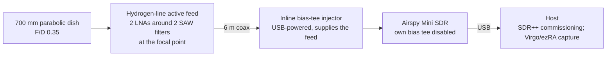

# Hydrogen Line Receiver

A small-dish receiver for the 21 cm (1420.4058 MHz) emission line of neutral hydrogen. The goal is detection of Galactic hydrogen, followed by Doppler measurements of the Milky Way's spiral arms and, over a year of operation, the annual modulation from Earth's orbital velocity.

The 1400–1427 MHz band is internationally protected for radio astronomy, which is why this experiment works even from an urban rooftop.

## Signal chain

Two architectural rules drive this design:

**Amplify before you lose.** The system noise figure is set almost entirely by the first amplifier, so the amplification lives at the antenna. Here that is automatic: both LNA stages sit inside the weatherproof feed at the focal point, ahead of all 6 m of coax. Losses after the LNAs are benign; before them, they are unrecoverable.

**Power architecture.** The feed is *active* — it draws roughly 5 V at ~120 mA up the coax through a bias tee. Two consequences follow. First, the feed must be powered: a dedicated inline bias-tee injector (USB-powered) sits between the feed's coax and the SDR. Second, an SDR's built-in bias tee often cannot source enough current for an active feed, so the injector does the job and the SDR's internal bias tee is left disabled to avoid a conflicting supply. The feed carries an internal DC block on its output, so no DC reaches the SDR.

This replaces the earlier discrete chain (a separate wideband LNA followed by a standalone 1420 MHz bandpass filter, USB-powered with the SDR's bias tee off). Folding the two LNA stages and two SAW filters into one sealed, weatherproof feed removes several connectors and coax runs from the front end and fixes the LNA-then-filter ordering that a discrete build has to choose. The trade is the inverted power rule above: the front end now depends on bias-tee power rather than avoiding it.

## Why these parts

- **Airspy Mini** over an RTL-SDR: a 12-bit ADC (vs 8-bit) buys roughly 24 dB of dynamic range, and a 0.5 ppm TCXO keeps a spectral line from drifting with temperature — both matter when the signal is a small bump on the noise floor and the science is in its frequency. (Note the bias-tee caveat above: the injector, not the Mini's internal bias tee, powers the feed.)
- **Parabolic dish with an integrated active feed** over a DIY LNA + filter + mesh-dish chain: the LNAs and SAW filters come factory-matched and sealed against weather, the front end is simpler and more reproducible, and the feed is swappable — the same dish accepts L-band satellite and GOES/S-band feeds for other projects. A 700 mm dish gives a wide half-power beam (~21° at 1420 MHz), which barely resolves Galactic structure but is more than adequate to detect the line and measure a rotation curve; integration time, not aperture, is the design lever.
- **Wide beam, long integrations.** The narrow-beam alternative would demand a much larger, wind-loaded dish. A small forgiving beam plus long dwell times reaches the same detection for a fraction of the mechanical complexity.

## Mounting

The dish and its feed ride a mast: a speaker-stand-class tripod for portable sessions, and a non-penetrating ballasted mount for a permanent rooftop installation. Wind, not weight, is the design load — the dish is light (~1.5 kg), so every leg is ballasted and membrane penetrations are avoided. The SDR and its host sit in a weatherproof enclosure on the same mast, close to the dish, since the feed's coax is short. A coax/Ethernet grounding block is installed at the building entry, as the dish becomes one of the tallest metal objects on the structure.

## Observation plan

1. **Commissioning:** confirm the feed is drawing bias-tee current, then a waterfall at 1420.4 MHz with gain set to avoid front-end overload.
2. **First detection:** pointed integrations (60–300 s) toward the Galactic plane in Cygnus, which transits near the zenith at this latitude; the on-plane vs off-plane spectral difference is the detection.
3. **Rotation curve:** spectra at multiple galactic longitudes; Doppler offsets map spiral-arm velocities.
4. **Long duration:** fixed-pointing daily spectra for a year to trace Earth's ±30 km/s orbital velocity as a ±142 kHz annual sinusoid, plus continuous drift-scan mapping. See [operations](operations.md).
