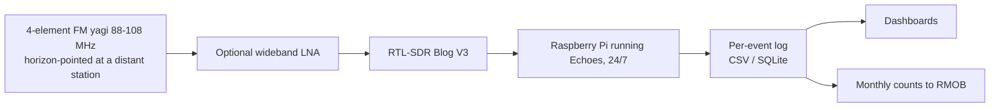

# Meteor Scatter Station

A 24/7 unattended detector for meteors, using forward scatter of FM broadcast signals. Meteors ionize the upper atmosphere; for a fraction of a second the trail reflects VHF signals from transmitters far over the horizon. Each "ping" on a locally-quiet frequency is a meteor.

Europe commonly uses the GRAVES radar at 143.05 MHz as the illuminator; North America has no equivalent, and analog TV carriers are gone. The standard US method is FM broadcast forward scatter: choose a frequency that is silent locally but hosts a high-power station 500–1500 km away, and point a small yagi at it.

## Signal chain

## Design notes

- **Frequency selection** is the whole game: use a station-finder (e.g. radio-locator.com) to shortlist channels with no local or adjacent-channel occupant, then find a 50–100 kW station 500–1500 km distant on each. Test candidates over a few nights.
- **Antenna:** a commercial 4-element FM yagi (Stellar Labs 30-2460 class) or a DIY 3-element cut to the exact target frequency. Horizontal polarization, slight upward tilt (0–15°).
- **Receiver:** an RTL-SDR V3 is sufficient — this is a dedicated always-on appliance, so a $38 dongle beats tying up a better SDR.
- **Software:** Echoes (open source, runs on Raspberry Pi) performs automatic ping capture, screenshots, and statistics; its per-event output feeds trivially into downstream logging.

## Discrimination and data quality

- Real pings are narrowband whistles/blips (0.1–2 s); aircraft produce long Doppler-smeared streaks; household RFI produces broadband clicks. Each is visually and statistically separable.
- Sporadic meteor rates peak near dawn (Earth's leading edge) — a built-in sanity check.
- Shower vs sporadic rate comparison is the first science product; the Perseids (Aug 12–13) are the commissioning target.

The receiver chain here is ~90% of an NOAA APT weather-satellite station; swapping the yagi for a 137 MHz V-dipole is a planned reuse.
